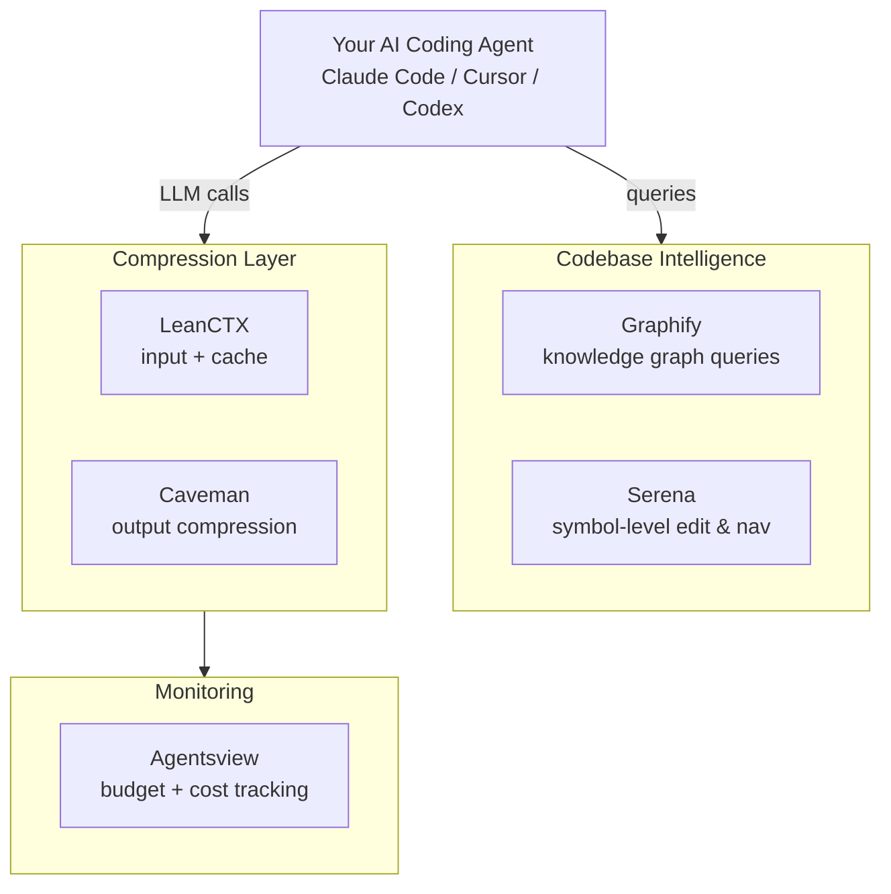

# Token Optimization Stack

[](https://opensource.org/licenses/MIT) [](http://makeapullrequest.com) [](TOKEN_OPTIMIZATION_STACK.md)

A curated, open-source stack to cut AI coding agent token usage. Step-by-step setup for Graphify, Serena, LeanCTX, Caveman, and Agentsview — designed for developers and agents alike.

> **Status (2026-08-25): the token-savings claims below are per-tool vendor claims, not
> this project's own measured result.** A pilot benchmark that actually scored
> correctness (not just token counts) found the combined stack breaking previously
> working fixes on a cheap model, with the biggest token-savings numbers coming from
> the runs that failed the task. The pilot was stopped before it could be run
> rigorously enough to publish a trustworthy number either way — see
> [the postmortem](https://shreyasht.github.io/token-optimization-stack/) and
> [`token-stack-benchmarks`](https://github.com/shreyasht/token-stack-benchmarks) for
> the full data. Treat this repo as documentation of a hypothesis under test, not a
> validated result. Contributions welcome.

## Why This Exists

AI coding agents re-send the full conversation history on every tool call. A 20-step task compounds a 50K-token first message into 500K+ tokens. Most of that spend is avoidable with the right tooling.

This repo is a single, agent-readable document that covers the full stack — from codebase intelligence to compression — with install commands, verification steps, and stacking notes.

## Architecture



## The Stack

| Layer | Tool | Token Savings |
|-------|------|---------------|
| Codebase Intelligence | [Graphify](https://github.com/Graphify-Labs/graphify) | 7–70x fewer input tokens |
| Codebase Intelligence | [Serena](https://github.com/oraios/serena) | Symbol-level edit & nav |
| Input Compression | [LeanCTX](https://github.com/yvgude/lean-ctx) | 60–90% fewer input tokens |
| Output Compression | [Caveman](https://github.com/JuliusBrussee/caveman) | ~65% fewer output tokens |
| Monitoring | [Agentsview](https://github.com/kenn-io/agentsview) | Visibility into token spend & agent traces |

## Quick Start

### ⚡ One-Line Automated Setup

```bash
chmod +x setup.sh && ./setup.sh
```

### 🛠️ Manual Step-by-Step Installation

```bash
# 1. Codebase intelligence
pip install graphifyy && graphify install && graphify build .
uv tool install serena-agent

# 2. Context layer
curl -fsSL https://raw.githubusercontent.com/yvgude/lean-ctx/v3.9.19/install.sh | sh && lean-ctx setup

# 3. Output compression
curl -fsSL https://raw.githubusercontent.com/JuliusBrussee/caveman/v2.3.1/install.sh | bash

# 4. Monitoring
pip install agentsview && agentsview init
```

See [TOKEN_OPTIMIZATION_STACK.md](TOKEN_OPTIMIZATION_STACK.md) for the full guide with configuration details, verification steps, stacking notes, and troubleshooting.

## For AI Agents

This repo is designed to be read by AI agents setting up a new environment. Point your agent at `TOKEN_OPTIMIZATION_STACK.md` — it contains install commands, verification steps, and an agent-specific instructions section at the bottom.

## Contributing

**Read the status note at the top first.** The pilot found the stack breaking working
fixes while the token dashboard looked great — so "measurable token savings" alone is
no longer a bar this project accepts. Token savings are necessary, not sufficient.

**Adding a new tool to the stack.** Open a PR. The criteria:

- Open-source
- Works with at least one major AI coding agent
- Includes reproducible install steps
- **Comes with a correctness check, not just a token count.** Show the tool solving
  a real, verifiable task (a test suite that passes/fails, not a vibe check) both
  with and without the tool. A savings number with no correctness evidence next to
  it will be asked for one, not merged.

**Picking up where the pilot stopped.** This is probably the more useful way to
contribute right now — the tool list is mostly settled, the open questions aren't.
Three concrete ones from [the postmortem](https://shreyasht.github.io/token-optimization-stack/):

- Why does the stack sometimes produce a real patch that applies cleanly but doesn't
  fix the bug? (Different from the empty-patch failure, which is already explained.)
- Run the full 5-arm ablation (baseline → +Graphify → +Serena → +LeanCTX → +Caveman)
  instead of just baseline-vs-full-stack. The current evidence points at Caveman
  specifically for the one failure that's been root-caused — that's a hypothesis to
  confirm, not a settled fact.
- Rerun the pilot on Sonnet or Opus instead of Haiku, and check whether the
  correctness regression shrinks. The prediction in the postmortem is that a weaker
  model makes this worse, not better — that's testable.

PRs against `token-stack-benchmarks` (the harness) are as welcome as PRs here.

## License

[MIT](LICENSE)
