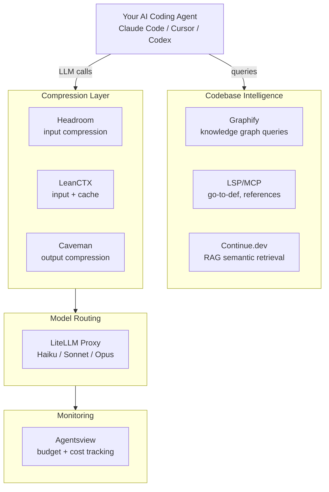

# Awesome Token Optimization Stack

[](https://opensource.org/licenses/MIT) [](http://makeapullrequest.com) [](TOKEN_OPTIMIZATION_STACK.md)

A curated, open-source stack to cut AI coding agent token usage by 70–90%. Step-by-step setup for Graphify, Headroom, Caveman, LeanCTX, LiteLLM, Continue.dev, LSP/MCP, and Agentsview — designed for developers and agents alike.

## Why This Exists

AI coding agents re-send the full conversation history on every tool call. A 20-step task compounds a 50K-token first message into 500K+ tokens. Most of that spend is avoidable with the right tooling.

This repo is a single, agent-readable document that covers the full stack — from codebase intelligence to compression to model routing — with install commands, verification steps, and stacking notes.

## Architecture



## The Stack

| Layer | Tool | Token Savings |
|-------|------|---------------|
| Codebase Intelligence | [Graphify](https://github.com/Graphify-Labs/graphify) | 7–70x fewer input tokens |
| Codebase Intelligence | [LSP via MCP](https://github.com/isaacphi/mcp-language-server) | ~50ms vs 45s grep |
| Codebase Intelligence | [Continue.dev](https://github.com/continuedev/continue) | 60–80% fewer input tokens |
| Input Compression | [Headroom](https://github.com/chopratejas/headroom) | 60–95% fewer input tokens |
| Input Compression | [LeanCTX](https://github.com/yvgude/lean-ctx) | 60–90% fewer input tokens |
| Output Compression | [Caveman](https://github.com/JuliusBrussee/caveman) | ~65% fewer output tokens |
| Monitoring | [Agentsview](https://github.com/agentsview/agentsview) | Visibility into token spend & agent traces |
| Model Routing | [LiteLLM](https://github.com/BerriAI/litellm) | 70–75% cost reduction |

## Quick Start

### ⚡ One-Line Automated Setup

```bash
chmod +x setup.sh && ./setup.sh
```

### 🛠️ Manual Step-by-Step Installation

```bash
# 1. Codebase intelligence
pip install graphifyy && graphify install && graphify build .

# 2. Input compression
pip install "headroom-ai[all]" && headroom wrap claude

# 3. Output compression
curl -fsSL https://raw.githubusercontent.com/JuliusBrussee/caveman/main/install.sh | bash

# 4. Context layer
curl -fsSL https://leanctx.com/install.sh | sh && lean-ctx setup

# 5. Monitoring
pip install agentsview && agentsview init

# 6. Model routing
pip install litellm && litellm --config litellm_config.yaml --port 4000
```

See [TOKEN_OPTIMIZATION_STACK.md](TOKEN_OPTIMIZATION_STACK.md) for the full guide with configuration details, verification steps, stacking notes, and troubleshooting.

## For AI Agents

This repo is designed to be read by AI agents setting up a new environment. Point your agent at `TOKEN_OPTIMIZATION_STACK.md` — it contains install commands, verification steps, and an agent-specific instructions section at the bottom.

## Contributing

Found a new tool that belongs in the stack? Open a PR. The criteria:

- Open-source
- Measurable token or cost savings
- Works with at least one major AI coding agent
- Includes reproducible install steps

## License

[MIT](LICENSE)
